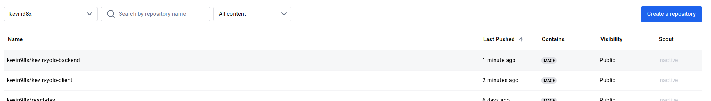

# Overview
This project involved the containerization and deployment of a full-stack yolo application using Docker and Ansible automation.

# Requirements

## Core Requirements
- [Docker](https://docs.docker.com/engine/install/)
- [Vagrant](https://www.vagrantup.com/downloads)
- [Ansible](https://docs.ansible.com/ansible/latest/installation_guide/intro_installation.html)
- [VirtualBox](https://www.virtualbox.org/wiki/Downloads)

## Python Dependencies
```bash
pip install ansible docker-py
```

# Directory Structure
```
project-root/
├── Vagrantfile
├── ansible.cfg
├── inventory.yml
├── playbook.yml
├── roles/
│   ├── setup-mongodb/
│   ├── backend-deployment/
│   └── frontend-deployment/
└── group_vars/
    └── all.yml
```

# How to launch the application

## Option 1: Using Vagrant and Ansible (Recommended)
1. Clone the repository:
```bash
git clone <repository-url>
cd <project-directory>
```

2. Start the Vagrant Virtual Machine and provision with Ansible:
```bash
vagrant up --provision
```

3. Access the application:
- Frontend: http://localhost:3000
- Backend API: http://localhost:5000
- MongoDB: localhost:27017

## Option 2: Manual Docker Setup
If you prefer to run without Vagrant/Ansible, you can use Docker directly:

```bash
docker-compose up -d
```



# Troubleshooting

## Common Issues
1. Port conflicts:
```bash
sudo netstat -tulpn | grep LISTEN
```

2. Vagrant/Ansible issues:
```bash
vagrant destroy -f
vagrant up --provision
```

3. Docker issues:
```bash
docker-compose down
docker-compose up --build
```

# Development

## Running Individual Components
```bash
# Run specific roles
ansible-playbook playbook.yml --tags "frontend"
ansible-playbook playbook.yml --tags "backend"
ansible-playbook playbook.yml --tags "mongodb"
```

## Checking Logs
```bash
# Vagrant VM logs
vagrant ssh
sudo journalctl -fu docker

# Docker container logs
docker-compose logs -f  
```


